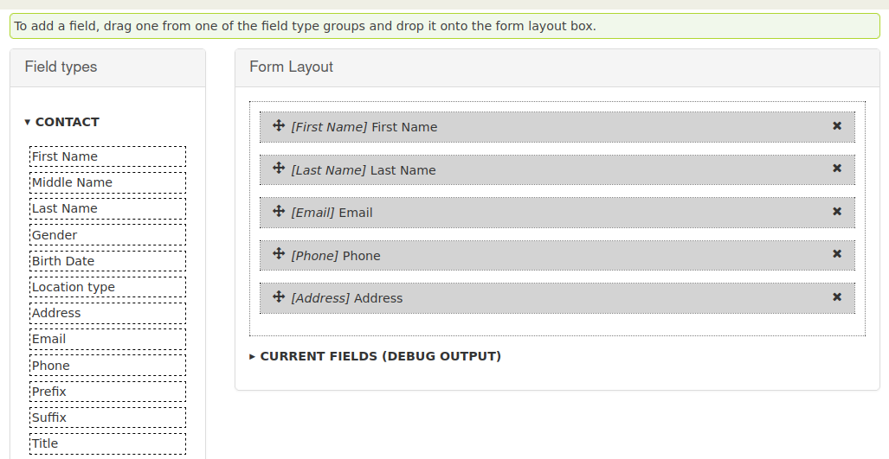

# Event Form Editor (CiviRemote)

This extension allows to build event registration forms with an editor. Those
forms can be used in the
[Remote Events](https://github.com/systopia/de.systopia.remoteevent) extension.



Common fields of contacts as well as custom fields of contacts and participants
are available.

This extension is licensed under [AGPL-3.0](LICENSE.txt).

## Requirements

* PHP 7.4 or PHP 8
* CiviCRM 5.48+
* [Remote Event](https://github.com/systopia/de.systopia.remoteevent) 1.2+
* Requirements specified in `composer.json`
  * webmozart/assert
  * symfony/polyfill-php80 (if PHP 7.4 is used.)

If the requirements specified in `composer.json` are not available, use
`composer` to install them. If CviCRM is set up via composer, you may want to
use `composer require`. Alternatively you can just run `composer install` in
the extension's directory.

## Installation (CLI, Zip)

Sysadmins and developers may download the `.zip` file for this extension and
install it with the command-line tool [cv](https://github.com/civicrm/cv).

```bash
cd <extension-dir>
cv dl remoteeventformeditor@https://github.com/systopia/remoteeventformeditor/archive/main.zip
```

## Installation (CLI, Git)

Sysadmins and developers may clone the [Git](https://en.wikipedia.org/wiki/Git) repo for this extension and
install it with the command-line tool [cv](https://github.com/civicrm/cv).

```bash
git clone https://github.com/systopia/remoteeventformeditor.git
cv en remoteeventformeditor
```

## Credits

The initial development was partly funded by Evangelische Kirche im Rheinland (Protestant Church Rhineland). Thank you!

## We need your support
This CiviCRM extension is provided as Free and Open Source Software, and we are happy if you find it useful. However, we have put a lot of work into it (and continue to do so), much of it unpaid for. So if you benefit from our software, please consider making a financial contribution so we can continue to maintain and develop it further.

If you are willing to support us in developing this CiviCRM extension, please send an email to info@systopia.de to get an invoice or agree a different payment method. Thank you! 
